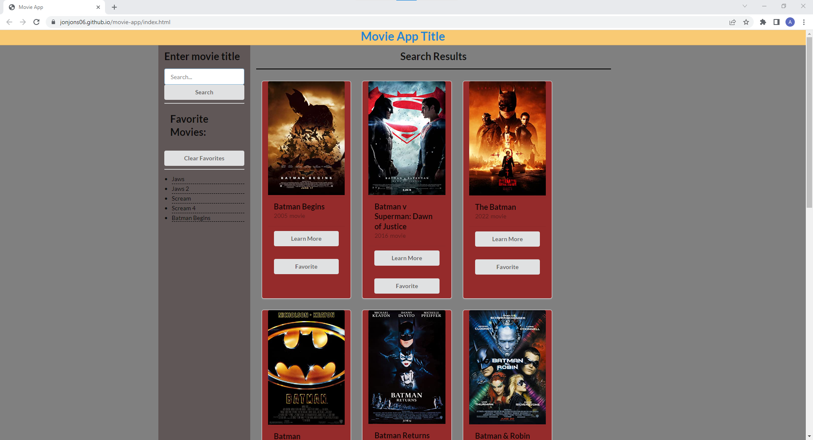
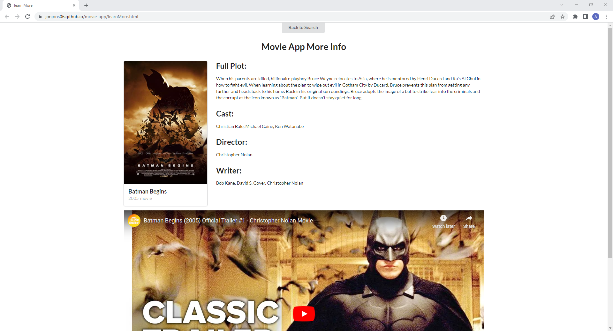

# movie-app
## Description
This is a Movie App that was created to allow a user to search movies that they like or are interested in. Once they search a movie title they will be presented with different options of movies that include the serched term, and will be presented with some basic info about each one. The user can then add a specific movie to favories, or click 'learn more' to be taken to another page with more in depth information about that movie. This webpage allows a user to quickly gather information about any movie they wish.

## Installation
N/A
## Usage
Upon load the user will be presented with a search bar and a list of any favorited movies that they have not cleared out. They can input a movie title and hit either the enter key or the search button to easily submit their search. The webpage will then generate information cards for each of the matching search results. These cards include basic information for the user to look through, such as Title, release year, and type of work. Each card will also have a 'Learn More' button and a 'Favorite' button that the user can interact with. Upon clicking the 'Learn More' button the user will be re-directed to a second page where more in depth information about the movie they have chosen will be displayed for them. This includes a full plot, cast, director, and writer.The user will also be presented with a trailer from youtube. The user can scan through this information and when they are done they can hit the 'back to search' button to return to the main page and begin searching again. If a user clicks the 'Favorite' button on any of the cards, the title of that movie will be saved to local Storage and displayed on the left side of the screen where it is easily visible and will persist even on page re-load. If the user ever wishes to clear their Favorites list, they can easily do so by hitting the 'Clear Favorites' button, this will clear out all of their saved movies. 
https://jonjons06.github.io/movie-app/

## License

N/A